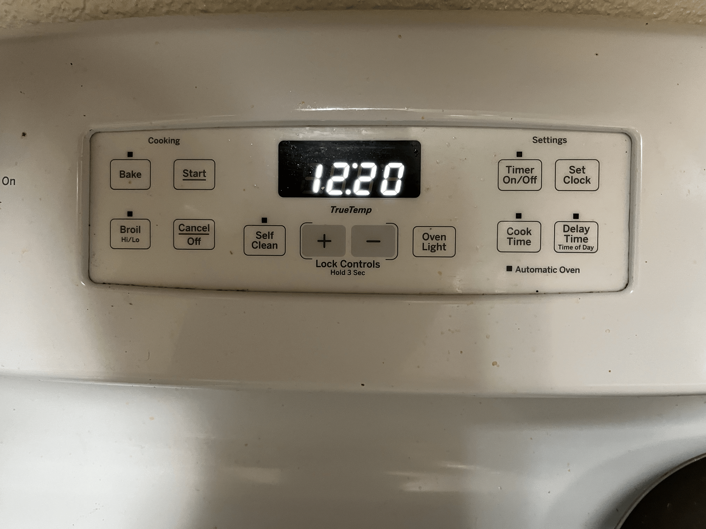
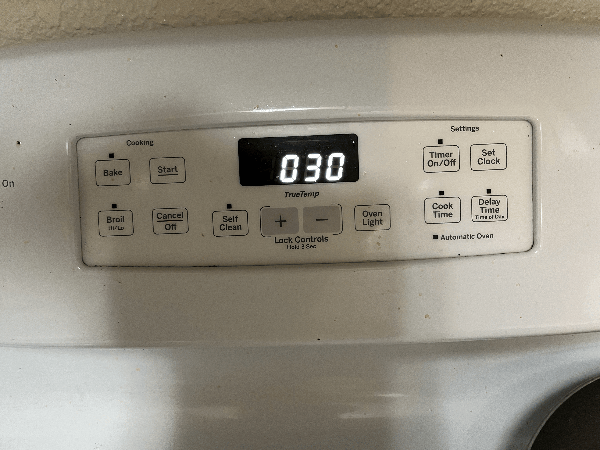
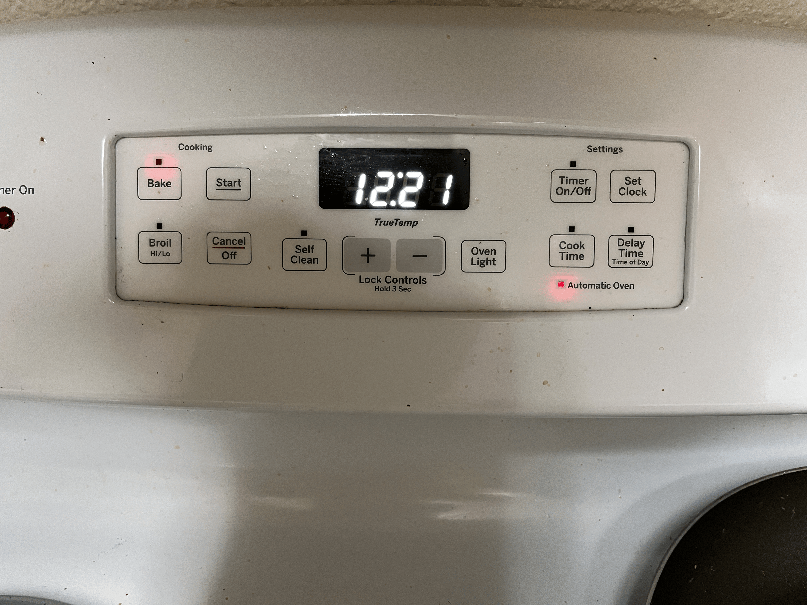

## My Experience with my GE Oven
# My Goal
I returned home from my studies feeling hungry and had prepared some chicken breasts thawed beforehand. I wanted to make baked chicken breasts, but knew that I could not monitor my oven while showering. I saw that the oven had a timer option and wanted to use it instead of attending to my oven.

# Attempt at accomplishing my goal
In order to get the timer setting of the oven working, I first selected the Timer on/off option of my oven. 
I then saw the timer of the oven change to zeroes.

I then assumed that altering the time altered the number of minutes the oven was turned on. After changing the time, I selected the set clock option. I then saw that the bake option was flashing, so I pressed it and set the temperature. 

I then pressed start, and by the time that I finished my shower, the oven had turned off.

# Notes on attempt / Improvements
I felt that the control panel had provided sufficient **feedback** given my inputs. After entering the desired time, the bake option started flashing, implying that additional inputs were still required. Seeing the PRE option after selecting my temperature and then the start button ensured that I had started the oven. The **affordances** of the control pannel were extremely useful in getting me started with the timer. I did not even have to look up how to set the timer as the menu options were clearly labeled in their function, and the flashing lights had also served to guide me with my next action.
